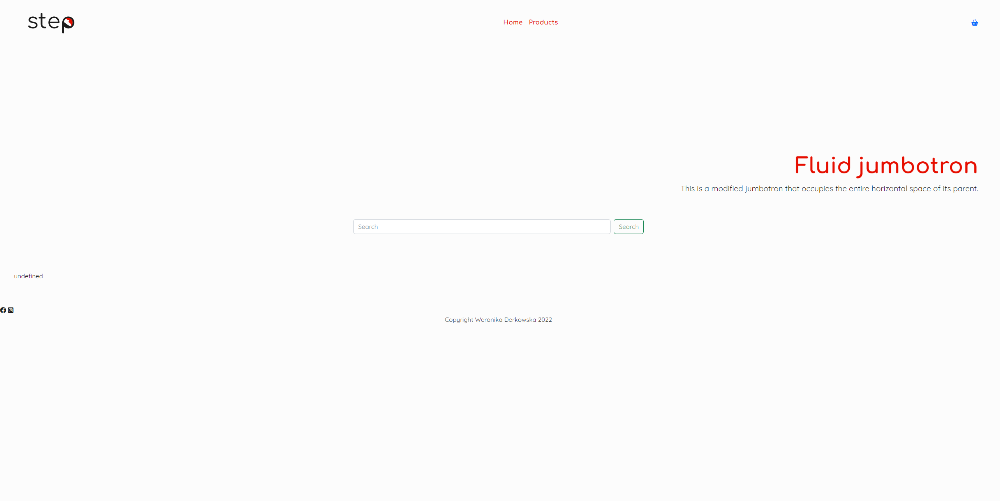

# Semester_Project2
## Front-end Development 2nd Year

During this project we need to create e-commerce website fallowing the architecture described below



## Description

We can find /create logo matching subject (company selling sport shoes). Site need to have good user experience and UI design.
We need to build a frontend with home, product list, product detail and cart pages. For admin - pages to create, update and delete products.
Website need to be responsive on all devices.

## Customer-facing pages

- Home Page with hero banner and list of featured products.
- Products Page with list of all products added to Strapi, each displaying title, price and image and should likt to product detail page.
- Product Details Page with: title / description / image / price / add to cart button.
- Cart/Basket Page with: title / price / a link to the product view page / image.

## Admin Section

- Login/Logout form using local storage to keep the user logged in
- Add/Edit Products form, it must also allow the user to toggle whether a product is featured.

## Built With

- [React.js](https://reactjs.org/)
- [Bootstrap](https://getbootstrap.com)

## Getting Started

### Installing

1. Clone the repo:

```bash
git clone https://github.com/werodev/Semester_Project2.git
```

2. Install the dependencies:

```
npm install bootstrap
```

### Running

To run the app, right click the index.html and "Open with Live Server"

## Contact

[My LinkedIn page](https://www.linkedin.com/in/weronika-derkowska-a00459179/)
